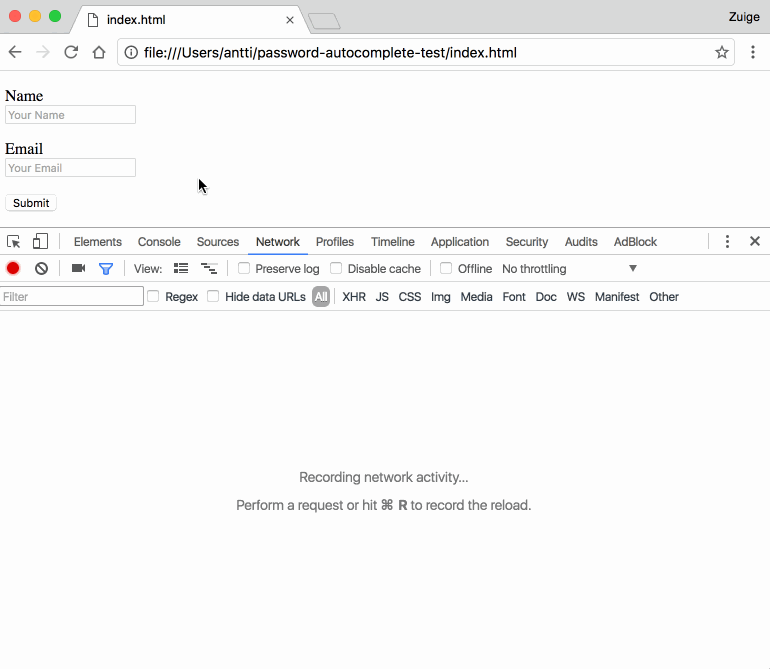

# Browser Autofill Phishing 🐟

This is a simple demonstration of form fields hidden from the user, but will be
filled anyways when using the browser form autofill feature, which poses a
security risk for users, unaware of giving their information to the website.

View the page at:
[https://anttiviljami.github.io/browser-autofill-phishing/](https://anttiviljami.github.io/browser-autofill-phishing/)

